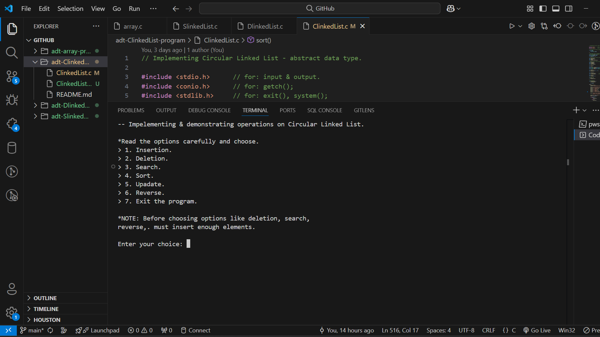
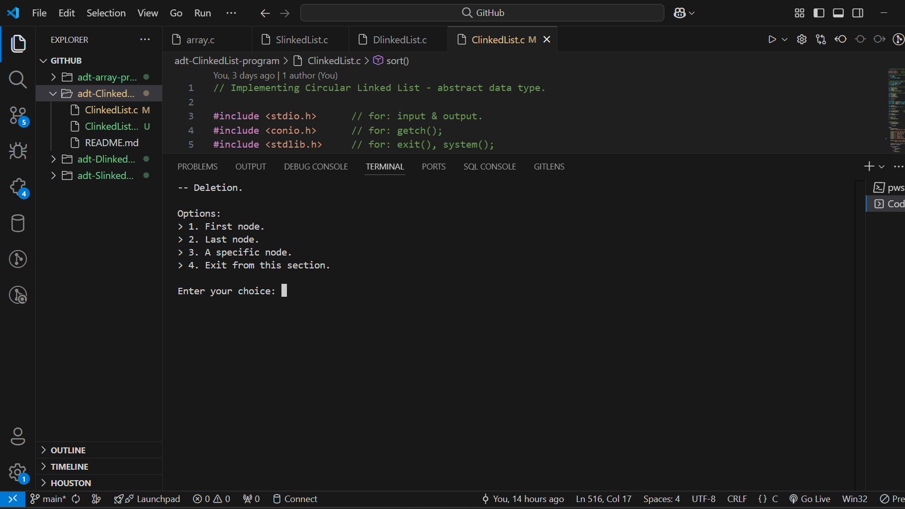

# adt-ClinkedList-program
C program implementing and demonstrating operations on Circular Linked List. Designed to help beginners understand operations related to Circular Linked List.



## Features
- Operation including: [Insertion](#insertion-operations), [Deletion](#deletion-operations), [Searching](#search-function), [Sorting](#sort-functions), [Updation](#update-function), [Reverse](#reverse-function).
- Menu driven program for easy interaction.
- Simple and clean code structure.

## Project Structure
```
adt-ClinkedList-program/
|-- ClinkedList.c  # Main program implementing ADT Circular Linked List
|-- README.md  # Project documentation
```

## Requirements
- **C Compiler** (GCC, MinGW, or any compatible)
- **VS Code** or any code editor

## Installation Guide
- Clone the repository using HTTP/SSH URL.
```bash
git clone https://github.com/gulshan-41/adt-ClinkedList-program.git
```
- Navigate to the project directory.
```bash
cd adt-ClinkedList-program.
```

## Program Variables
- struct node { int data; struct node *linkN; };
- struct node *headN = NULL;
- struct node *tail = NULL;
- int nodeCounter = 0;

## Program Functions
Main functions that construct the whole program includes, main(), welcomeScreen(), insertion(), deletion(), search(), sort(), update() & reverse().


## Insertion Operations


- Insert a node at the beginning of the list, while maintaining circularity of the list.
```bash
void atBeginning() {
    struct node *newNode = malloc(sizeof(struct node));
    if (!newNode) {
        printf("\nError: Memory allocation failed!.\n");
        exit(1);
    }

    printf("\nnewNode->data: ");
    scanf("%d", &(newNode->data));

    newNode->linkN = headN;
    headN = newNode;
    tail->linkN = headN;

    nodeCounter++;
}
```
- Insert a node at the end of the list.
```bash
void atEnd() {
    struct node *newNode = malloc(sizeof(struct node));
    if (!newNode) {
        printf("\nError: Memory allocation failed!.\n");
        exit(1);
    }

    printf("\nnewNode->data: ");
    scanf("%d", &(newNode->data));

    newNode->linkN = headN;
    tail->linkN = newNode;
    tail= newNode;
    
    nodeCounter++;
}
```
- Insert a node at a specified serial number.
```bash
void atASpecificPosition() {
    int index;

    struct node *newNode = malloc(sizeof(struct node));
    if (!newNode) {
        printf("\nError: Memory allocation failed!.\n");
        exit(1);
    } else {
        printf("\nnewNode->data: ");
        scanf("%d", &(newNode->data));
        newNode->linkN = NULL;
        printf("serial: ");
        scanf("%d", &index);

        struct node *p = headN;

        // The serial number should be between the list, or at the end.
        if(index > nodeCounter + 1 || index < 1) {
            printf("\nError: Enter a valid serial number.");
            printf("\nPress any key to continue...");
            getch();
            insertion();
        } else if(index == 1) {
            newNode->linkN = headN;
            headN = newNode;
            tail->linkN = headN;

        } else if(index == nodeCounter + 1) {
            newNode->linkN = headN;
            tail->linkN = newNode;
            tail= newNode;

        } else {
            for(int i = 1; i < index - 1; i++) {
                p = p->linkN;
            }
            newNode->linkN = p->linkN;
            p->linkN = newNode;
        }
    }

    nodeCounter++;
}
```

## Deletion Operations



- Deleting the first node from the list, while maintaining circularity of the list.
```bash
void firstNode() {
    if(nodeCounter == 1) {
        headN->linkN = NULL;
        
        free(headN);
        headN = NULL;
        tail = NULL;

    } else {
        struct node *p = headN;
        headN = headN->linkN;
        tail->linkN = headN;
        
        free(p);
        p = NULL;
    }

    nodeCounter--;
}
```
- Deletes the last node from the list.
```bash
void lastNode() {
    if(headN == tail) {
        free(headN);
        headN = NULL;
        tail = NULL;

    } else {
        struct node *p1 = headN;
        struct node *p2 = NULL;

        for(int i = 1; i < nodeCounter; i++) {
            p2 = p1;
            p1 = p1->linkN;
        }
        tail = p2;
        tail->linkN = headN;

        free(p1);
        p1 = NULL;
    }

    nodeCounter--;
}
```
- Deletes a specific node, specified by it's serial number.
```bash
void specificNode() {
    int index;
    struct node *p1 = headN;
    struct node *p2 = NULL;

    printf("\nserial no.: ");
    scanf("%d", &index);

    if(index >= nodeCounter + 1 || index < 1) {
        printf("\nError: Enter a valid serial number.");
        printf("\nPress any key to continue...");
        getch();
        deletion();
    } 
    // Case 1: Deleting the only node in the list.
    else if(index == 1 && nodeCounter == 1) {
        free(headN);
        headN = NULL;
        tail = NULL;
    } 
    // Case 2: Deleting the first node in a multi-node list
    else if(index == 1) {
        headN = headN->linkN;
        
        free(p1);
        p1 = NULL;

    } 
    // Case 3: Deleting the last node
    else if(index == nodeCounter) {
        for(int i = 1; i < index; i++) {
            p2 = p1;
            p1 = p1->linkN;
        }
        p2->linkN = headN;

        free(p1);
        p1 = NULL;

    } 
    // Case 4: Deleting a node in the middle
    else {
        for(int i = 1; i < index; i++) {
            p2 = p1;
            p1 = p1->linkN;
        }
        p2->linkN = p1->linkN;

        free(p1);
        p1 = NULL;
    }

    nodeCounter--;
}
```

## Search Function
- Search a specific node, taking reference it's data & returns it's serial number.
```bash
void search(){
    screenCleaner();

    int target, i, flag = 0, choice;

    if(headN == NULL) {
        printf("\nError: The list is empty.\n");
        printf("Press any key to continue...");
        getch();
        welcomeScreen();
    }

    printL();

    printf("\nelement: ");
    scanf("%d", &target);

    struct node *p = headN;

    do {
        if(target == p->data) {
            flag++;
            printf("\nserial no.: %d", i);
        }
        p = p->linkN;
    } while(p != headN);

    if(flag == 0) {
        printf("\nelement not found!");
    }

    printf("\n\n> 1. Continue to search elements.\n");
    printf("> 2. Exit from this section.\n");
    printf("\nyour choice: ");
    scanf("%d", &choice);

    switch(choice) {
        case 1:
            search();
            break;
        case 2:
            welcomeScreen();
            break;
        default:
            printf("\nError: Choose from the given options.");
            printf("\nPress any key to continue...");
            getch();
            welcomeScreen();
    }
}
```

## Sort Functions
- Sort the list (in ascending order) using merge sort algorithm.
```bash
void sort() {
    screenCleaner();

    struct node *p = NULL;

    printL();

    if(headN == NULL || headN->linkN == headN) {
        printf("\nError: The list is empty or it has only one node!\n");
        printf("Press any key to continue...");
        getch();
        welcomeScreen();
    }

    // Breaking the circularity.
    tail->linkN = NULL;
    tail = NULL;

    headN = mergeSort(headN);

    // Re establishing the connection to maintain circularity.
    p = headN;
    while(p->linkN != NULL) {
        p = p->linkN;
    }
    tail = p;
    tail->linkN = headN;

    printL();

    printf("\nPress any key to continue...");
    getch();
    welcomeScreen();
}
```
```bash
struct node * mergeSort(struct node *headN) {

    if (headN == NULL || headN->linkN == NULL) {
        return headN;
    }

    struct node *second = split(headN);

    headN = mergeSort(headN);
    second = mergeSort(second);

    return merge(headN, second);
}
```
```bash
struct node * split(struct node *headN) {

    struct node *fast = headN->linkN;
    struct node *slow = headN;

    while (fast != NULL && fast->linkN != NULL) {
        fast = fast->linkN->linkN;
        slow = slow->linkN;
    }

    struct node *temp = slow->linkN;
    slow->linkN = NULL;
    return temp;
}
```
```bash
struct node * merge(struct node * first, struct node * second) {

    if(first == NULL) return second;
    if(second == NULL) return first;

    if(first->data < second->data) {
        first->linkN = merge(first->linkN, second);
        return first;
    } else {
        second->linkN = merge(first, second->linkN);
        return second;
    }
}
```

## Update Function
- Update nodes with new data.
```bash
void update() {
    screenCleaner();

    int serial, data, uData, choice, errorCode;

    printf("Which node do you want to update?");
    printL();

    printf("\nserial no.: ");
    scanf("%d", &serial);
    printf("node's data: ");
    scanf("%d", &data);

    errorCode = verification(serial, data);
    if(errorCode == 4) {
        printf("\nError: Enter a valid serial number.");
        printf("\nPress any key to continue...");
        getch();
        update();
    } else if(errorCode == 5) {
        printf("\nError: The element is not present at the\n"
               "specified serial number. ");
        printf("\nPress any key to continue...");
        getch();
        update();
    }

    printf("\nnew->data: ");
    scanf("%d", &uData);

    struct node *p = headN;

    for(int i = 1; i < serial; i++) {
        p = p->linkN;
    }

    p->data = uData;

    printL();

    printf("\n> 1. Continue to update more elements.\n");
    printf("> 2. Exit from this section.\n");
    printf("\nyour choice: ");
    scanf("%d", &choice);

    switch(choice) {
        case 1:
            update();
            break;
        case 2:
            welcomeScreen();
            break;
        default:
            printf("\nError: Choose from the given options.");
            printf("\nPress any key to continue...");
            getch();
            welcomeScreen();
    }
}
```

## Reverse Function
- Reverse the links, ultimately turing the list.
```bash
void reverse() {
    screenCleaner();

    int choice;

    if(headN == NULL || headN->linkN == NULL) {
        printf("\nError: The list is empty or it has only one node!\n");
        printf("Press any key to continue...");
        getch();
        welcomeScreen();
        return;
    }

    printL();

    struct node *prev = tail;
    struct node *current = headN;
    struct node *next = NULL;
    struct node *start = headN;

    do {
        next = current->linkN;      // Store next node
        current->linkN = prev;      // Reverse the link
        prev = current;             // Move prev to current
        current = next;             // Move current to next
    } while (current != start);     // Traverse until full circle

    tail = headN;   
    headN = prev;   

    printL();

    printf("\n> 1. Reverse one more time OR.\n");
    printf("> 2. Exit from this section.\n");
    printf("\nyour choice: ");
    scanf("%d", &choice);

    switch(choice) {
        case 1:
            reverse();
            break;
        case 2:
            welcomeScreen();
            break;
        default:
            printf("\nError: Choose from the given options.");
            printf("\nPress any key to continue...");
            getch();
            welcomeScreen();
    }
}
```

## Helper Functions
- Helper functions include,. printL(), screenCleaner(), tryAgain(int ) & verification(int , int ).

## Contact
For queries, feel free to reach out:
- Email: main.gulshan2003@gmail.com
- GitHub: [gulshan-41](https://github.com/gulshan-41)
